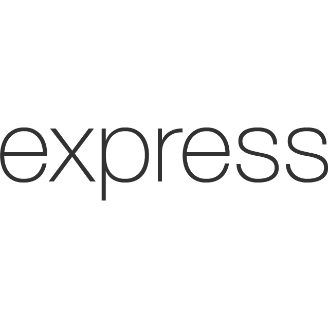

# BBBasic (Backbone Basic)#
 | |
--- | --- |
## Summary ##
Take the mystery out of Backbone.js and get started with a fully functional REST API boilerplate application. Read and follow along with the comments. 

Using Backbone on the frontend and MongoDB, Node and Express on the backend, you can follow along with and adjust the code to the individual needs of your app. 

## How to Get Started ##

Navigate to an empty project directory and: 

```sh
npm install bbbasic
```

## Testing ##
For your convenience, the Mocha and Chai testing suites have been included so that you can customize them for your project. 

## Deployment ##
After adjusting the templates and tests to fit the individual needs of your app, get your server + database up and running and deploy to a service like [Azure](https://azure.microsoft.com/en-us/get-started/) or [Heroku](https://devcenter.heroku.com/start) to complete the process.

## Tech Stack ##
|||||
--- | --- | --- | --- | --- |
Backbone.js|MongoDB|Node.js|Express.js|Mocha & Chai|

## Team ##
[](https://github.com/existenzial) <br>Jazz Lyles
<br>[LinkedIn](https://www.linkedin.com/in/jazzlyles)
<br>[Twitter](https://twitter.com/JazzLyles)
<br>[Site](http://jazzlyles.com)